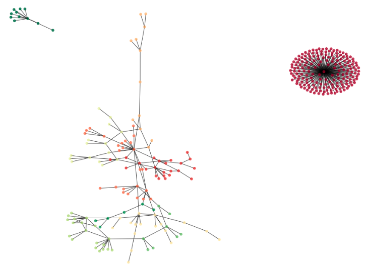

# sma-twitter-user-communities

Assignment for the Social Media Analysis course at WUST (Wroclaw University of Science and Technology).

### Project steps
1. Tweets acquiring from dates between 22.10.2020 and 24.10.2020 with hashtag `#zakazaborcji` which is related with controversional polish Constitutional Court decision concerning abortion.
2. Acquisition of all user tweets found in step 1 (from the period 15.10.2020 - 24.10.2020).
3. Users graph building - users as nodes and edges between users based on mentions in tweets.
4. Detecting communities and visualizing them.
5. Analysis users activities in most meaningfull communitites.
6. Performing users classification task on prepared data.

### Scope: knowledge and skils
* understanding Twitter data
* Twitter data acquisition
* Jupiter ipython notebooks
* python:  
	* data organization: pandas
	* graphs: networkx
	* machine learning: scikit-learn
	* NLP: polyglot 
	* scrapping: twint

### Outcome
Analysis available in notebooks.

Example of visualization
